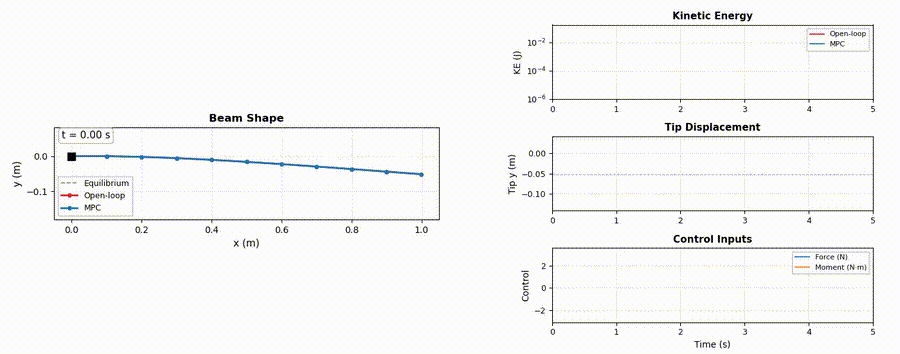
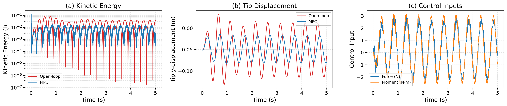

# DERMPC

Nonlinear Model Predictive Control (NMPC) for vibration suppression of a flexible cantilever beam, modeled using 2D Discrete Elastic Rods (DER). The controller is built with [acados](https://github.com/acados/acados) and [CasADi](https://web.casadi.org/).

## Overview

This project implements a receding-horizon NMPC framework to actively suppress vibrations in a flexible beam subject to external disturbances. The beam is discretized as a planar DER model, where bending and stretching energies are derived analytically and differentiated symbolically via CasADi. The resulting nonlinear dynamics are passed to acados, which generates and compiles an efficient C-based SQP-RTI solver for real-time optimal control.

The simulation compares an **open-loop** response (no control) against a **closed-loop** MPC-controlled response under a sinusoidal tip disturbance, demonstrating significant vibration reduction.

**Key features:**
- 2D DER beam with bending, stretching, gravity, and structural damping
- Configurable actuators (force and moment inputs at arbitrary nodes)
- acados NMPC with LINEAR_LS cost, warm-starting, and SQP-RTI
- PBD (Position Based Dynamics) inextensibility enforcement in simulation
- Side-by-side open-loop vs. MPC comparison with quantitative metrics

## Results

Under a 1 N sinusoidal disturbance (2 Hz) applied at the beam tip, the NMPC controller achieves **67.9% kinetic energy reduction** and reduces the RMS tip deviation by approximately 50%, with all 500 MPC solves converging successfully.



| Metric | Open-loop | MPC |
|---|---|---|
| Mean kinetic energy | 2.17e-02 J | 6.97e-03 J |
| RMS tip deviation | 4.55e-02 m | 2.28e-02 m |



## Installation

### 1. Create conda environment

```bash
conda env create -f environment.yml
conda activate der_mpc
```

Or install dependencies manually:

```bash
pip install numpy scipy matplotlib casadi pyyaml
```

### 2. Build acados (C library)

The NMPC solver requires the acados C library built from source:

```bash
git clone https://github.com/acados/acados.git
cd acados && mkdir build && cd build
cmake .. -DCMAKE_INSTALL_PREFIX=<install_prefix>
make -j4 && make install
```

Then install the Python interface:

```bash
pip install -e <acados_root>/interfaces/acados_template
```

### 3. Set environment variables

Before running, set the acados paths:

```bash
export ACADOS_SOURCE_DIR=<acados_root>
export LD_LIBRARY_PATH=$LD_LIBRARY_PATH:$ACADOS_SOURCE_DIR/lib
```

### 4. Install the project

```bash
pip install -e .
```

## Usage

```bash
python run.py                    # headless, saves plots to results/
python run.py --live             # real-time visualization
python run.py --no-mpc           # open-loop only
python run.py --config my.yaml   # custom config
```

## Project Structure

```
DERMPC/
├── run.py            # Entry point: open-loop vs. MPC comparison
├── config.yaml       # All parameters (rod, control, disturbance, MPC, etc.)
├── der_mpc/
│   ├── dynamics.py   # DER beam model (CasADi symbolic + NumPy simulation)
│   ├── sim.py        # Simulator with disturbance and history
│   ├── mpc.py        # acados NMPC controller
│   └── viz.py        # Real-time dashboard and summary plots
├── results/          # Generated plots
├── requirements.txt
├── environment.yml
└── pyproject.toml
```

## Configuration

All parameters are in `config.yaml`:

| Section | Parameters |
|---|---|
| `rod` | n_nodes, length, EI, EA, linear_density, damping, gravity |
| `control` | Actuator definitions (type, node, direction, bounds) |
| `disturbance` | External force (node, type, amplitude, frequency) |
| `sim` | dt, duration, pbd_iter, obs_noise_std |
| `mpc` | N (horizon), dt, cost weights, solver options |

## Method

The beam is discretized into `n_nodes` nodes. The first `n_fixed` nodes are clamped (cantilever boundary condition). Internal forces are derived from the total elastic energy:

- **Bending**: discrete curvature formulation with Voronoi lengths
- **Stretching**: quadratic penalty on edge-length deviation (in MPC); Position Based Dynamics projection (in simulation)
- **Gravity** and **linear damping** on all free nodes

The NMPC minimizes a weighted sum of position deviation, velocity (vibration), and control effort over a receding horizon, solved via acados SQP-RTI with an implicit Runge-Kutta integrator.

## License

MIT
